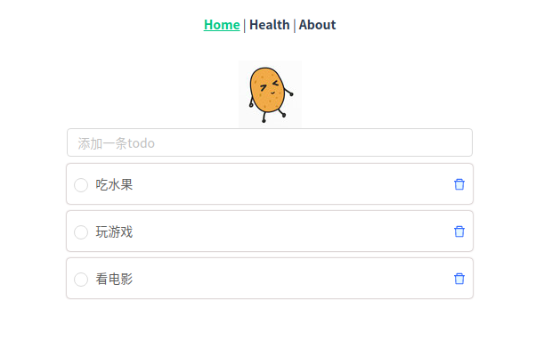

# 基于 go 语言的 restful api 实践
> gin+gorm+vue

just for fun,  for learn.

client 开发中......

## api
```shell script
POST /token 申请token, 需携带key:matata
```
### todos
```
# 访问todos api 需携带token
GET    /v1/todos 
GET    /v1/todos/:id
POST   /v1/todos
PUT    /v1/todos/:id
DELETE /v1/todos/:id
```
### health: api状态检测
```shell script
GET /sd/health  api status
GET /sd/cpu     cpu status
GET /sd/ram     ram usage
GET /sd/disk    disk usage
```

### how to run

首先在mysql创建todo数据库`create database todo;`

#### server
```shell script
cd server
go run main.go
```
#### client
```shell script
cd client
npm install
npm run serve
```

### mini系列
[mini_search](https://github.com/shiniao/mini_search)——hakuna电影搜索引擎(elasticsearch+flask+vue)

[mini_sms_classify](https://github.com/shiniao/mini_sms_classify)——小型垃圾邮件分类系统（naive_bayes+flask+vue）

[mini_mnist](https://github.com/shiniao/mini_mnist)——mini手写数字识别(CNN+flask+vue)

### 联系我
email: zhuzhezhe95@gmail.com