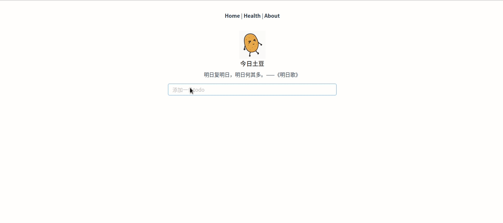

# todos-go 
A todos restful-api service base on go language, use gin+gorm+vue.

This todos servie is for learning go web development, Use a front-end and back-end separation approach.
front-end use Vue and back-end use Gin. just for fun,  for learn.

## show


## how to run
```
> git clone https://github.com/shiniao/mini_todo.git

# mysql create database:
> create database todo;

# Then change the file config.yaml for your needs.

# run server
> cd server
> go run main.go

# run client
cd client
npm install
npm run serve
```

## todos api

You can visit `.../swagger/index.html` for more detail.

First, use todos api you need to get a token, Then take tokens with each visit:

```shell script
POST /token get a token, need take `key:matata`
```

That's all api:
```
GET    /v1/todos 
GET    /v1/todos/:id
POST   /v1/todos
PUT    /v1/todos/:id
DELETE /v1/todos/:id
```